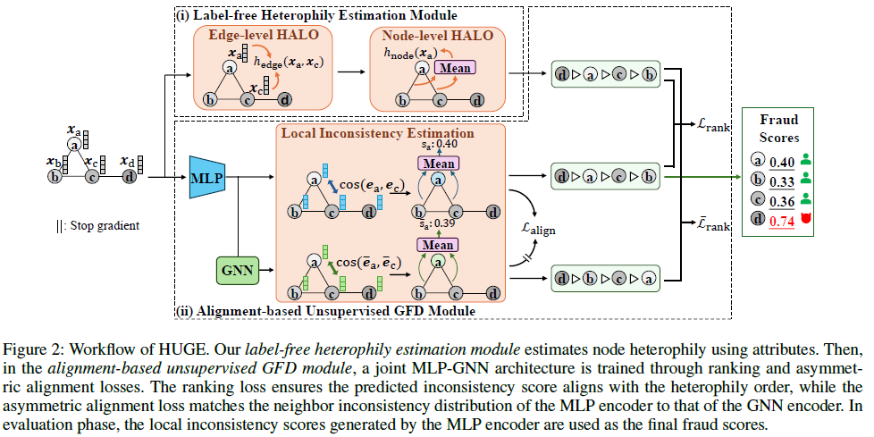

# HUGE-GAD
Code for AAAI 25 "A Label-free Heterophily-guided Approach for Unsupervised Graph Fraud Detection

The code will be uploaded soon. 

# HUGE: A Label-Free Heterophily-Guided Approach for Unsupervised Graph Fraud Detection

Junjun Pan, Yixin Liu, Xin Zheng, Yizhen Zheng, Alan Wee-Chung Liew, Fuyi Li, Shirui Pan
---
This repo contains the official implementation of [AAAI25 PREM: A Label-Free Heterophily-Guided Approach for Unsupervised Graph Fraud Detection](https://arxiv.org/)


     
To reproduce the results proposed in the paper, run 

### Amazon

```
python main.py --dataset Amazon --lr 5e-4 --kd_param 0.5 --epoch 300 --seed 0
```

### Facebook

```
python main.py --dataset Facebook --lr 5e-4 --kd_param 0.5 --epoch 300 --seed 0
```

### Reddit

```
python main.py --dataset Reddit --lr 5e-4 --kd_param 0.5 --epoch 300 --seed 0
```

### YelpChi

```
python main.py --dataset YelpChi --lr 5e-4 --kd_param 0.5 --epoch 300 --seed 0
```

### AmazonFull

```
python main.py --dataset AmazonFull --lr 5e-4 --kd_param 1.0 --epoch 10 --seed 0
```

### YelpChiFull

```
python main.py --dataset YelpChiFull --lr 1e-5 --kd_param 3--epoch 5 --seed 0
```

---


### Environment

The code is tested under conda environment (py 3.9.18) with these additional libs installed: 

Please let us know if you find other libs are also required. 

```
dgl==1.1.2+cu117
torch==2.0.0+cu117
torch-geometric==2.5.2+cu117
torch-cluster==1.6.3+cu117
torch-scatter==2.1.2+cu117
torch-sparse==0.6.18+cu117
tqdm==4.64.1
```


